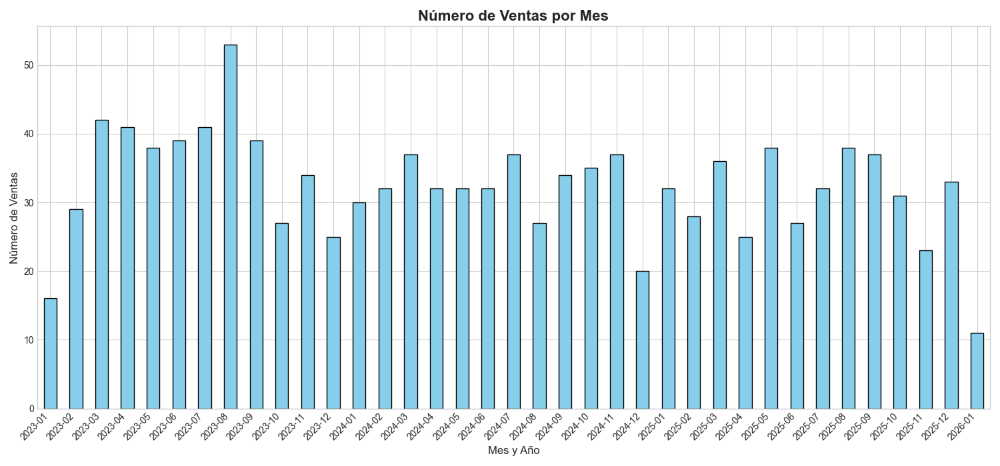

# Análisis 2: Distribución Temporal de Ventas

**Fecha:** 15 de Enero de 2026

**Autor:** Gemini

## 1. Objetivo

El objetivo de este análisis es entender cómo se distribuyen las ventas a lo largo del tiempo. Comprender la estacionalidad o las tendencias en el comportamiento de compra es fundamental para el negocio y un paso clave para validar la calidad de los datos de "Recencia" que se usarán en el análisis RFM.

## 2. Proceso

Se ejecutó el script `03_plot_ventas_por_mes.py`, que realiza los siguientes pasos:
1.  Carga el archivo `ventas.csv`.
2.  Convierte la columna `fecha` a un formato de fecha y hora (`datetime`).
3.  Agrupa las transacciones por mes y año para contar el número de ventas en cada período.
4.  Genera un gráfico de barras que visualiza el número de ventas a lo largo del tiempo.
5.  Guarda el gráfico resultante en la carpeta `plots/`.

## 3. Resultados y Observaciones

A continuación se muestra el gráfico generado.

**Gráfico: Número de Ventas por Mes**

### Observaciones:
- **Distribución Aleatoria:** El gráfico muestra el número de ventas mensuales a lo largo de los últimos 3 años. Dado que los datos fueron generados sintéticamente con una distribución aleatoria en el tiempo, el gráfico no presenta una tendencia clara (crecimiento o decrecimiento) ni un patrón estacional predecible (picos en Diciembre, por ejemplo).
- **Variabilidad:** Se observa una variabilidad natural mes a mes, con algunos meses teniendo más ventas que otros, lo cual es esperable en un entorno real.
- **Calidad del Dato:** La presencia de ventas a lo largo de todo el período de 3 años confirma que el campo `fecha` es diverso y útil para calcular la Recencia de los clientes. No hay vacíos temporales o formatos de fecha incorrectos evidentes.

## 4. Conclusión

El análisis temporal muestra que los datos de ventas están distribuidos a lo largo del período de tiempo esperado. Aunque no se observan patrones (debido a la naturaleza sintética de los datos), el análisis confirma que el conjunto de datos es adecuado para proceder con la Fase de Preparación de Datos, donde se calculará la Recencia para cada cliente.
