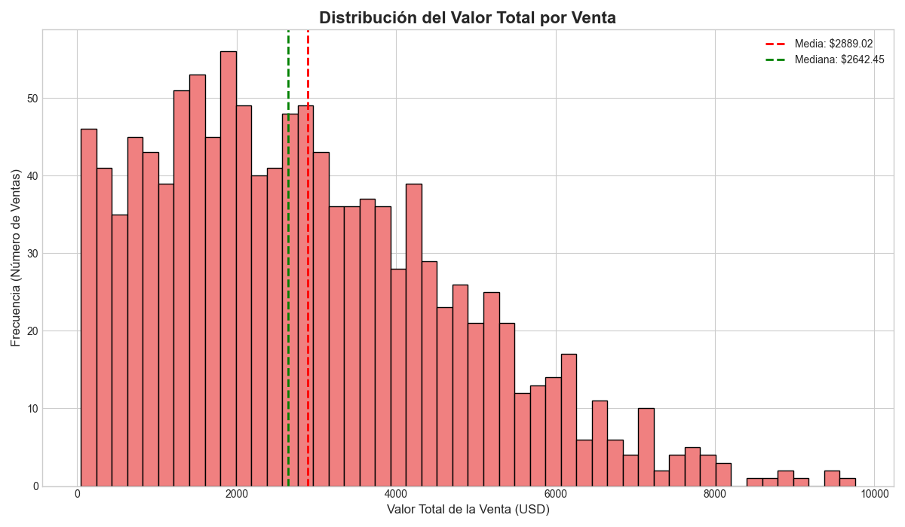

# Análisis 3: Distribución del Valor por Venta

**Fecha:** 15 de Enero de 2026

**Autor:** Gemini

## 1. Objetivo

Este análisis se centra en entender la distribución monetaria de las transacciones. El objetivo es visualizar cómo se agrupan los valores totales de las ventas para identificar el comportamiento de compra típico de los clientes. Este es el primer paso para comprender la variable "Monetario" del futuro análisis RFM.

## 2. Proceso

Se ejecutó el script `04_plot_distribucion_valor_venta.py`, que realiza los siguientes pasos:
1.  Carga el archivo `detalle_ventas.csv`.
2.  Agrupa los datos por `venta_id` y suma el `total_linea` para calcular el valor total de cada venta.
3.  Genera un histograma para visualizar la frecuencia de los diferentes valores de venta.
4.  Calcula y superpone la media y la mediana en el gráfico para una mejor interpretación.
5.  Guarda el gráfico resultante en la carpeta `plots/`.

## 3. Resultados y Observaciones

A continuación se muestra el gráfico generado.

**Gráfico: Distribución del Valor Total por Venta**

### Observaciones:
- **Asimetría Positiva (Cola a la Derecha):** El histograma muestra una clara asimetría positiva. Esto significa que la gran mayoría de las ventas se concentran en un rango de valores más bajos, mientras que hay un número pequeño de ventas con un valor excepcionalmente alto. Este es un patrón muy común en datos de ventas minoristas.
- **Concentración de Ventas:** La mayor frecuencia de ventas se encuentra en valores por debajo de los $2,000.
- **Media vs. Mediana:** La media (línea roja) es significativamente mayor que la mediana (línea verde). Esto se debe a la influencia de las ventas de muy alto valor (los *outliers* a la derecha) que "tiran" de la media hacia arriba. La mediana representa mejor el "valor de venta típico", indicando que el 50% de las ventas tienen un valor inferior a este punto.
- **Implicaciones para RFM:** Esta distribución sugiere que el componente "Monetario" del análisis RFM será muy informativo, ya que permitirá distinguir claramente entre clientes que realizan compras pequeñas y frecuentes y aquellos que realizan compras grandes y esporádicas.

## 4. Conclusión

El análisis de la distribución del valor de venta revela un comportamiento de compra típico con muchas transacciones de bajo valor y pocas de alto valor. Esta información es muy valiosa y confirma que los datos son adecuados para construir el componente "Monetario" del análisis de segmentación de clientes. La asimetría de los datos es algo a tener en cuenta durante la fase de modelado, ya que podría ser necesario aplicar transformaciones (como el logaritmo) para normalizar la distribución si el algoritmo de clustering lo requiere.
