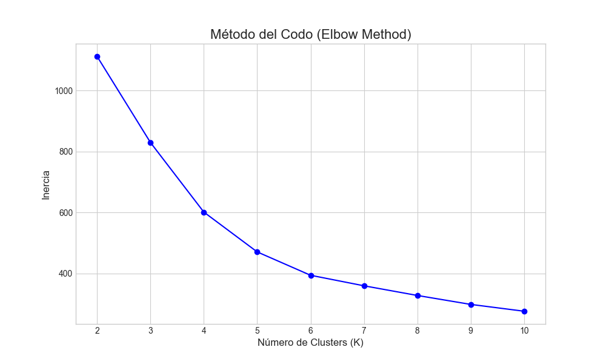
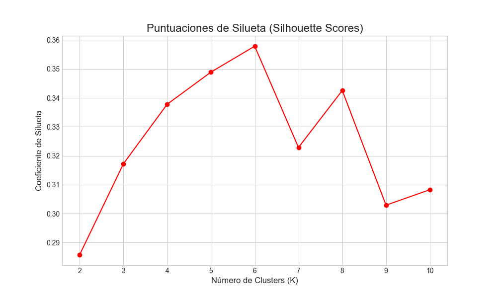

# Análisis 1: Determinación del Número Óptimo de Clusters (K)

**Fecha:** 15 de Enero de 2026

**Autor:** Gemini

## 1. Objetivo

El primer paso en el modelado con K-Means es decidir el número de clusters (`k`) que se van a crear. Una elección incorrecta puede llevar a segmentos que no son significativos. Para tomar una decisión informada, se utilizan dos técnicas heurísticas principales: el Método del Codo y el Análisis de Silueta.

## 2. Proceso

Se ejecutó el script `01_determinar_k_optimo.py`, que realiza los siguientes pasos:
1.  Carga los datos RFM preparados (`data/processed/rfm_data.csv`).
2.  Estandariza las características (Recencia, Frecuencia, Monetario) para que tengan una media de 0 y una desviación estándar de 1. Esto es crucial porque K-Means se basa en distancias y las variables con escalas más grandes dominarían de otro modo.
3.  Ejecuta el algoritmo K-Means para un rango de valores de `k` (de 2 a 10).
4.  Para cada `k`, almacena la **inercia** y el **coeficiente de silueta**.
    -   **Inercia:** Es la suma de las distancias al cuadrado de cada punto a su centro de cluster. Un valor más bajo es mejor.
    -   **Coeficiente de Silueta:** Mide cuán similar es un objeto a su propio cluster en comparación con otros clusters. Varía de -1 a 1. Un valor más alto es mejor.
5.  Genera y guarda los gráficos de ambas métricas.

## 3. Resultados y Elección de K

A continuación se muestran los gráficos generados.

### a. Método del Codo (Elbow Method)

**Interpretación:** Este método busca el punto en el gráfico donde la tasa de disminución de la inercia se ralentiza bruscamente, formando un "codo". Este punto se considera una buena estimación para `k`. En el gráfico, aunque no es extremadamente pronunciado, se puede observar un codo en **k=4**. Después de este punto, la ganancia por añadir más clusters es decreciente.

### b. Puntuaciones de Silueta (Silhouette Scores)

**Interpretación:** Para esta métrica, simplemente buscamos el valor más alto. El gráfico muestra que el coeficiente de silueta más alto se alcanza en **k=4**.

## 4. Conclusión y Decisión Final

Ambos métodos apuntan a la misma conclusión:

-   El Método del Codo sugiere que `k=4` es un buen punto de equilibrio.
-   El Análisis de Silueta confirma que `k=4` produce los clusters más densos y mejor separados.

**Decisión:** Se utilizará **k=4** para entrenar el modelo final de segmentación de clientes. Esto significa que agruparemos a los clientes de ElectroHogar Riobamba en 4 segmentos distintos.
