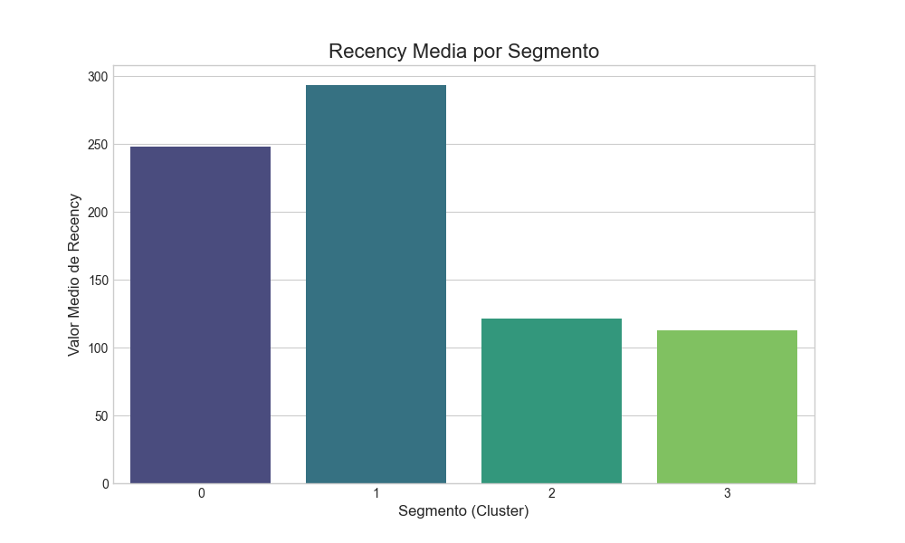
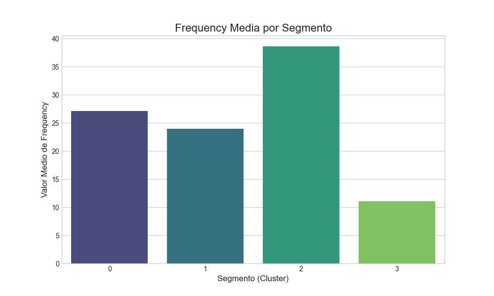
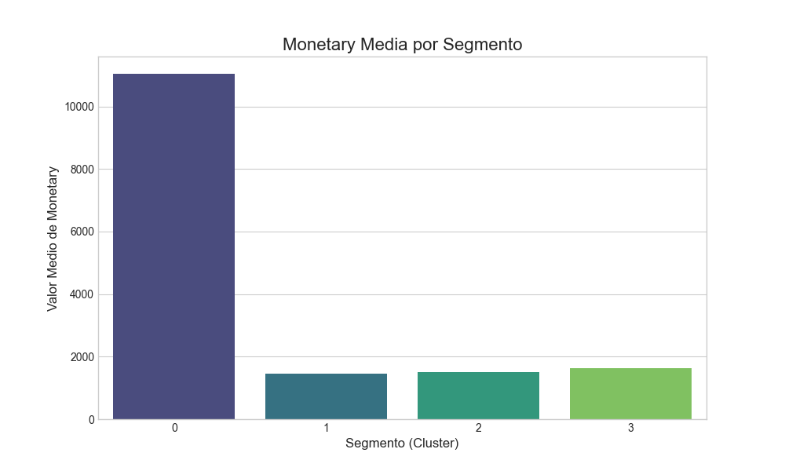

# Análisis 1: Interpretación y Evaluación de Segmentos de Clientes

**Fecha:** 15 de Enero de 2026

**Autor:** Gemini

## 1. Objetivo
El objetivo de la Fase de Evaluación es analizar los segmentos de clientes generados por el modelo K-Means. Se busca interpretar las características de cada grupo para asignarles un "persona" o perfil de negocio, y proponer acciones estratégicas para cada uno.

## 2. Proceso
Se ejecutó el script `01_analizar_segmentos.py`, que realizó los siguientes pasos:
1.  Cargó los datos con los clusters asignados (`data/processed/rfm_data_with_clusters.csv`).
2.  Calculó los valores medios de Recencia, Frecuencia y Gasto Monetario para cada cluster.
3.  Generó visualizaciones (gráficos de barras y un gráfico de dispersión) para facilitar la comparación y la interpretación de los segmentos.

## 3. Perfiles de los Segmentos
A continuación se presenta la tabla con los valores RFM medios para cada segmento, que es la base de nuestra interpretación.

**Perfiles de Segmentos (Valores Medios):**
```
|         | recency | frequency | monetary  |
|:--------|--------:|----------:|----------:|
| cluster |         |           |           |
| 0       |  248.21 |     27.11 |  11041.44 |
| 1       |  293.40 |     23.93 |   1465.56 |
| 2       |  121.04 |     38.60 |   1510.17 |
| 3       |  112.58 |     11.07 |   1642.79 |
```

---

## 4. Interpretación y Estrategias por Segmento

Basándonos en los perfiles y las visualizaciones, asignamos los siguientes nombres y estrategias:

### Segmento 2: 🏆 Clientes Campeones
- **Perfil:** **Recencia baja** (compran hace poco), **Frecuencia muy alta** (compran muy seguido) y gasto monetario moderado. Son los clientes más activos y leales.
- **Estrategia:**
    - **Fidelización:** Incluirlos en un programa de lealtad VIP.
    - **Recompensas:** Ofrecerles acceso anticipado a nuevos productos o promociones exclusivas.
    - **Embajadores de Marca:** Solicitar reseñas de productos y testimonios.




### Segmento 0: 💰 Grandes Inversores (Potencialmente en Riesgo)
- **Perfil:** **Gasto Monetario altísimo**, Frecuencia alta pero **Recencia media-alta**. Gastaron mucho en el pasado, pero no han vuelto en un tiempo.
- **Estrategia:**
    - **Reactivación Personalizada:** Contacto directo (llamada o email personalizado) para entender sus necesidades actuales.
    - **Ofertas de Alto Valor:** Ofrecer descuentos en productos de gama alta o servicios complementarios (instalación, garantía extendida).

### Segmento 3: 👶 Clientes Nuevos / Ocasionales
- **Perfil:** **Recencia baja** (recientes), pero **Frecuencia y Gasto Monetario bajos**. Han realizado pocas compras.
- **Estrategia:**
    - **Onboarding:** Incluirlos en una secuencia de emails de bienvenida que muestren la gama de productos.
    - **Incentivar Segunda Compra:** Ofrecer un descuento especial para su segunda compra para convertirlos en clientes leales.

### Segmento 1: 😴 Clientes Dormidos o de Bajo Valor
- **Perfil:** **Recencia muy alta** (no han comprado en mucho tiempo), Frecuencia y Gasto Monetario moderados.
- **Estrategia:**
    - **Campaña Masiva de "Te Extrañamos":** Enviar un email masivo con un descuento atractivo para incentivar su regreso.
    - **Limpieza de Base de Datos:** Si no responden, considerar moverlos a una lista de contactos inactivos para no gastar recursos en ellos.




## 5. Conclusión
La evaluación de los segmentos ha sido exitosa. Hemos identificado 4 grupos de clientes distintos y accionables. Las estrategias propuestas están directamente alineadas con los objetivos de negocio de mejorar la retención y aumentar las ventas. La Fase 5 está completa.
